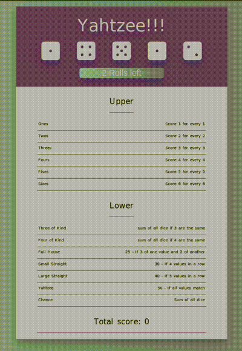

# Yahtzee

Welcome to the Yahtzee game repository. Yahtzee is a popular dice game that involves a combination of luck and strategy. 
In this version, players roll dice to make various scoring combinations and compete to achieve the highest score.

## Game Description

Yahtzee is played by rolling five dice to make certain combinations. 
The game consists of 13 rounds during which the player chooses which scoring combination to use in that round. 
Once a combination has been used in the game, it cannot be used again.

## How to Play

1. **Starting a Game**: visit [Yahtzee](https://junikab.github.io/Yahtzee-game)
2. **Choose Dice to Keep**: After each roll, choose which dice to keep by clicking on them.
3. **Continue Rolling**: You can roll the dice up to three times in a turn, but you can stop after the first or second roll if you choose.
4. **Score Your Roll**: After the rolls are complete, choose a scoring category for your roll. Each category can only be used once.
5. **End Game**: The game ends once all scoring categories have been filled. The player with the highest total score wins.

## Built With

- **React**: This game is built using [React](https://reactjs.org/), a JavaScript library for building user interfaces.
